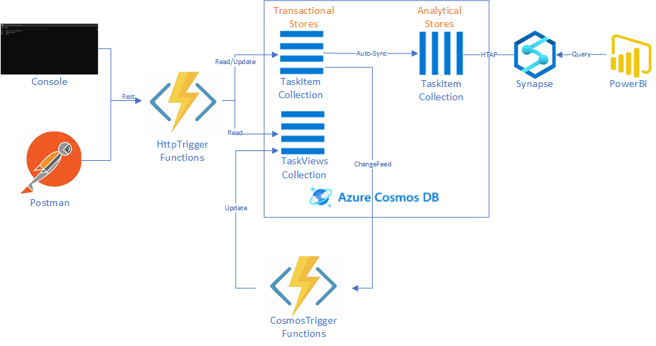

# Overview
This demo is setup to show how to leverage Azure Functions v3 SDK with the Azure Cosmos DB to demonstrate creating and managing documents using a serverless pattern as well as how to leverage [materialized views](https://docs.microsoft.com/en-us/azure/architecture/patterns/materialized-view) for speed and performance in the Cosmos DB platform.  The repo has samples written using [Cosmos v3 SDK](/v3) and [Cosmos v2 SDK](/v2) that illustrates the differences.

# Scenario Summary

This sample represents a task management system where a user can create tasks that are assigned to approvers. Approvers must be able to get a summary of the tasks that are assigned to them and then take action.

# Requirements

1. The system must be able to support multiple types of tasks.  The data model for task types will be different and new task types must be able to be added with minimal effort.
2. Tasks can be assigned to 1..n approvers.
3. When a task is complete, users will not need to bring it up in the application.
4. Approvers must be able to get a count of their open tasks.
5. Approvers must be able to get a summary of the tasks assigned to them.
6. All users must be able to get a list of tasks they created and are still open.
7. The system must be highly optimized to support 100's of tasks and approvals.
8. Analytics must allow for determining the volume of tasks being created, and the average time before they are closed.  It must be available in near real-time.

# Design Overview

## Data Repository
Cosmos DB is a fantastic NoSQL platform.  As with any platform, the biggest key to success is having a good architecture design to take advantage of the system.  [Modeling data in NoSQL](https://docs.microsoft.com/en-us/azure/cosmos-db/relational-nosql) is very different from the relational world.  A poor design will lead to poor performance and high cost of the platform.

### Tasks
Since we're building a task management system, the first thing we'll design for is the Task itself.  In a relational world, we'd need different types of tables to handle the requirement of having different types.  In the case of NoSQL and the flexible model, we can store all the types of tasks together.  If we start looking at a mock up of this, there is clearly a set of common attributes.
```
{
    "id": "guid"
    "summary": "A summary of the task",
    "detail": "Detailed description of the task",
    "type": "The kind of request it is",
    "submittedby": "The user id of who created the task",
    "approvers": [{
        "id": "The user ids of the approver",
        "name": "Name of the approver"
    },
    "status": "The status of the request.  In our case, the task will either be 'pending' or 'complete'" 
}
```
As we build on this, we can create two example kinds of tasks.

Vacation Task
```
{
    "id": "guid"
    "summary": "Vacation request for 4 days",
    "detail": "Detailed description of the task",
    "type": "vacation",
    "submittedby": "howard",
    "approvers": [{
        "id": "sam",
        "name": "Sam Adams"
    },
    {
        "id": "john",
        "name": "John Smith" 
    }],
    "start": "2020-02-01",
    "end":"2020-02-05",
    "status": "pending" 
}
```
Invoice Task
```
{
    "id": "guid"
    "summary": "Invoice from XYZ Company",
    "detail": "Detailed description of the task",
    "type": "invoice",
    "submittedby": "steve",
    "approvers": [{
        "id": "howard",
        "name": "Howard Ginsburg"
    },
    "amount": 1500,
    "status": "pending" 
}
```
All Cosmos collections require a partition key to distribute the data.  A few initial choices come to mind:
1. id - at first glance, this looks like a good choice because our data will be nicely distributed.  However, to get the list of tasks a user has created or the list of tasks a user needs to approve results in a [cross partition query](https://docs.microsoft.com/en-us/azure/cosmos-db/partitioning-overview#choose-partitionkey) which is something we want to avoid.
2. submittedby - choosing this option requires us to look at the alignment of users that submit tasks.  This allows us to have single partition reads for the user that submitted the task.  However, approvers will still result in a cross partition query.  Additionally, if we have a couple of users that submit a lot of tasks, and everyone else just submits a few, then it's possible our collection will be unbalanced.

### TaskView
A solution to eliminating the cross partition query is to introduce a [materialized view](https://docs.microsoft.com/en-us/azure/architecture/patterns/materialized-view) for each user.  For each user, we'll store a document that contains the list of tasks they've created, and the list of tasks they need to approve.  It must be easy to lookup.  A mockup looks like this.
```
{
    "id": "user id",
    "mytasks": [
        {
            "id": "task id",
            "type": "task type",
            "summary": "task summary"
        }
    ],
    "approvaltasks": [
      {
            "id": "task id",
            "type": "task type",
            "summary": "task summary",
            "submittedby": "user id"
        }
    ]
}
```
We'll store these documents in a separate collection and use 'id' (which is our user id) as our partition key.  This will lead to even distribution.

Note, the 'id' attribute in Cosmos DB is a special kind of attribute.  The value must be unique within a partition key.  If one is not provided, the Cosmos engine will generate a guid and add it to your document.  Thus, our Task document using a guid for 'id' will always be unique.  Since we're using user id for the 'id' in our TaskView, we can assume that user ids are unique.  we're also denomalizing the data a bit to show some of the task information in the task view.  This will allow our user interface to display an aggregate of the tasks without having to query each one.

### Point Query
The most efficient way to query a Cosmos DB collection is to use a [point query](https://devblogs.microsoft.com/cosmosdb/point-reads-versus-queries/).  A point query leverages a document id and partition key to return a single document.  For a user to see their list of tasks and approvals, we do can a point query on the TaskView collection using just their user id since it's both the document id and partition key.  Once we have that view, if they want to view/edit/approve a task, we can use the task id from the document to do a point query on the TaskItem collection to retrieve the document.

### Keeping The Data In Sync
A powerful feature of Cosmos DB is the [Change Feed](https://docs.microsoft.com/en-us/azure/cosmos-db/change-feed).  This will allow us to track which tasks have changed and from there we can retrieve and update our materialized views for the TaskView collection.

### Deleting Tasks
One of our requirements is to delete Tasks when they are completed.  Since we are managing the TaskViews materialized views through Change Feed, this creates a challenge.  Currently in Cosmos DB, documents that are deleted do not show up in the Change Feed for processing.  The pattern to address this is to specify a [Time to Live (TTL)](https://docs.microsoft.com/en-us/azure/cosmos-db/how-to-time-to-live) on the document.  By not explicitly deleting the Task document when it is set to complete, it will show up in the Change Feed and allow us to remove the task from the materialized views.  When the Time to Live expires, Cosmos DB will delete the document for us.

## API Layer
Our solution will leverage [Azure Functions](https://docs.microsoft.com/en-us/azure/azure-functions/functions-overview) as the API layer.  The serverless model, [bindings pattern](https://docs.microsoft.com/en-us/azure/azure-functions/functions-triggers-bindings), and [dependency injection model](https://docs.microsoft.com/en-us/azure/azure-functions/functions-dotnet-dependency-injection) they provide will enable us to focus on solving the business problem rather that building out infrastructure.  We will leverage [HTTPTrigger](https://docs.microsoft.com/en-us/azure/azure-functions/functions-bindings-http-webhook) functions to support our API layer to read/update Tasks, and the [CosmosTrigger](https://docs.microsoft.com/en-us/azure/azure-functions/functions-bindings-cosmosdb-v2) for the changefeed behavior to update the TaskView materialized views.

### Azure Functions and Cosmos DB SDK Versions
The bindings model for Azure Functions is very powerful, and can simplify the amount of code a developer would have to write.  The challenge is that the bindings are currently dependent on the Cosmos DB v2 SDK.  To leverage the Cosmos DB v3 SDK, we use dependency injection in [StartUp.cs](/v3/Startup.cs).  Both projects contain a CosmosHelper.cs class which helps us abstract the use of the Cosmos API.  In the v3 project it is passed to all functions through the constructor.  In the v2 project, bindings provide for a large chunk of the read/write behavior needed, with the exception of the TaskUpdateChangeFeedFunction.cs since it is reading/writing multiple materialized views.  For usage here, we get a handle to the DocumentClient using function bindings and create the CosmosHelper.

### Analyzing the differences between the Cosmos v3 and v2 usage patterns.
You can search for 'CosmosNote' to find comments specific to calling out something about the particular SDK version being used. 

We can use the Change Feed trigger for Azure Functions to get a serverless update whenever Tasks change.  From there we can retrieve and update our materialized views for the TaskView collection.  Note, currently the [Cosmos bindings for Azure Functions](https://docs.microsoft.com/en-us/azure/azure-functions/functions-bindings-cosmosdb-v2) leverages the Cosmos DB v2 SDK.  For the v3 SDK sample, we will see how the two SDKs can be used in harmony.

## Analytics

### Option 1 - Cosmos DB
Querying Cosmos at regular intervals will give us some of the analytics we're looking for.  However, we will be running cross partition queries across all data in the system.  In addition, as historical data grows, it will also require more request units to support this.

### Option 2 - Cosmos DB and Azure Synapse
One of the great new features of Cosmos is [Synapse Link](https://docs.microsoft.com/en-us/azure/cosmos-db/synapse-link).  This will allow us to have an analytical store that is also a part of the Cosmos DB account.  From there we can use a Serverless SQL Pool to query across our data and meet the needs of the analytical requirements.  Power BI can easily connect to the pool and run whatever queries we need.

# Architecture Diagram



# Running the Demo

## Azure Functions
### Locally
1. Visual Studio Code or Visual Studio.
2. Configure to use [Azure Functions](https://docs.microsoft.com/en-us/azure/azure-functions/functions-develop-local).
3. Install and start the [Azure Storage Emulator](https://docs.microsoft.com/en-us/azure/storage/common/storage-use-emulator).
4. Postman or some other REST client.
5. Create a Cosmos DB account in Azure that uses the SQL api OR install the [Cosmos DB Emulator](https://docs.microsoft.com/en-us/azure/cosmos-db/local-emulator).  You cannot setup the analytics portion of this solution when using the Cosmos DB Emulator.
6. Create a Database named Tasks with autoscale set to 4000 request units.  Autoscale will allow you to run the data generator without getting throttled.
7. Create a TaskItem collection with 'id' as the partition and database shared units.  Enable the Analytical Store to get metrics in Azure Synapse.
8. Specify Time to Live as On(no default).
9. Create a TaskViews collection with 'id' as the partition and database shared units.
10. Rename sample.settings.json to local.settings.json and place it in the directory of the version you want to run (ie v2 or v3 folder) add replace 'CosmosDBConnection' with you Cosmos account connection string.
11. Open the project (.csproj) of the v3 or v2 demo you want to run.
12.  Run the project.  The local Functions runtime will run and give you the urls for your functions.

### Azure
Note, if you plan to test locally and run in Azure at the same time, you must either use a separate lease collection for the Change Feed or specify a lease prefix so that both instances of the function will process the change feed.  The [Cosmos DB Trigger](https://docs.microsoft.com/en-us/azure/azure-functions/functions-bindings-cosmosdb-v2-trigger?tabs=csharp#configuration) goes into more detail.
1. Provision a Cosmos DB account.
2. Optional - If you plan to run the analytics part of the demo, "Enable Azure Synapse Link".
3. Create a Database named Tasks with autoscale set to 4000 request units.  Autoscale will allow you to run the data generator without getting throttled.
4. Create a TaskItem collection with 'id' as the partition and database shared units.  Optional - Enable the Analytical Store to get metrics in Azure Synapse.
8. Specify Time to Live as On(no default) for the collection. Optional - also set Time to Live as On(no default) Analytical Store on the TaskItem collection.
9. Create a TaskViews collection with 'id' as the partition and database shared units.
10. Provision an Azure Function App.
11. Create the 'CosmosDBConnection' app setting in the Function App and set it to your Cosmos DB connection string.
12. Deploy the Task Demo sample to the Function App.  You can easily deploy from [Visual Studio Code](https://docs.microsoft.com/en-us/azure/azure-functions/functions-develop-vs-code?tabs=csharp#publish-to-azure) or [Visual Studio](https://docs.microsoft.com/en-us/azure/azure-functions/functions-develop-vs#publish-to-azure).

## Analytics (Azure Only)
1. Create an Azure Synapse Workspace account and open the workspace.
2. Create a new Linked Service to your Cosmos account.
3. In the Development pane, create a new SQL Script.  Make sure you're connected to the 'Built-In' serverless sql pool.
4. Run the command to create a new database.
```
Create database TaskAnalytics
```
5. Change the database from 'master' to 'TextAnalytics' and create a view over top of the Cosmos DB analytical store.  Be sure to update the code with your Cosmos DB access key.
```
CREATE VIEW AllTasks
AS  
SELECT taskid, tasktype, submittedby, approverid,  CONVERT(DATETIME2, createddate) createddate, CONVERT(DATETIME2, completeddate) completeddate
FROM OPENROWSET('CosmosDB','<Super Secret Cosmos DB Key>',TaskItem)
WITH ( taskid varchar(40) '$.id',
        tasktype varchar(15) '$.type',
        createddate varchar(30) '$.createddate',
       completeddate varchar(30) '$.completeddate', 
       submittedby varchar(15) '$.submittedby',
       approvers varchar(max) '$.approvers' ) AS TaskItem
CROSS APPLY OPENJSON (approvers)
    with (approverid varchar(15) '$.id') AS approver
```

# API Testing
## Option 1
1. Run the sample console app [project](/client).

## Option 2
1. Run http://localhost:7071/api/UpdateTask passing in the vacation payload task above.  Copy the guid that is returned in the response.  Using the Data Explorer in Cosmos, you will see the task is created in the TaskItem collection, and three materialized views created in the TaskViews collection.
2. Run http://localhost:7071/api/GetTask/{replace-with-your-task-guid} to retrieve the Task document from Cosmos.
3. Run http://localhost:7071/api/GetTaskView/howard to see the materialized view for Howard.
4. Run http://localhost:7071/api/GetTaskView/sam to see the materialized view for Howard.
5. Using the response from Step 2, change the 'status' from 'pending' to 'complete', and run http://localhost:7071/api/UpdateTask.  Using the Data Explorer in Cosmos, you will see your updated task in the TaskItem collection with a new 'ttl' attribute set to 300 seconds.  The TaskViews collection will have no documents.  This is because our code deletes materialized views that have no tasks open or to be approved for the user.

# Analytics Testing
## Power BI
TODO!!

